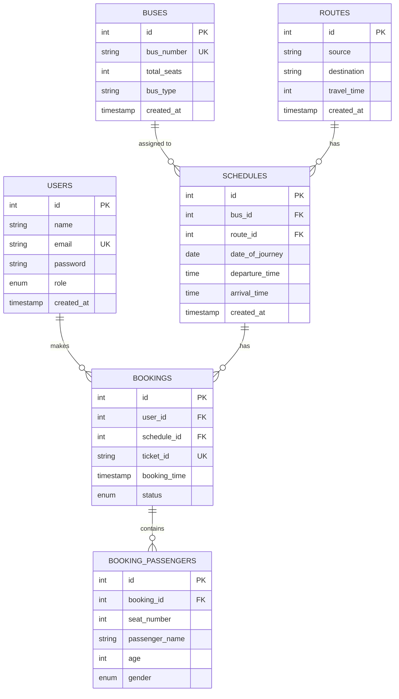

## Entity Relationship Diagram Explanation

This ER diagram represents a Bus Booking System with the following entities and relationships:

1. **USERS**
   - Primary key: id
   - Unique constraint: email
   - One user can make many bookings (1:N)

2. **BUSES**
   - Primary key: id
   - Unique constraint: bus_number
   - One bus can have many schedules (1:N)

3. **ROUTES**
   - Primary key: id
   - Composite index: source, destination
   - One route can have many schedules (1:N)

4. **SCHEDULES**
   - Primary key: id
   - Foreign keys: bus_id, route_id
   - One schedule can have many bookings (1:N)

5. **BOOKINGS**
   - Primary key: id
   - Foreign keys: user_id, schedule_id
   - Unique constraint: ticket_id
   - One booking can have many passengers (1:N)

6. **BOOKING_PASSENGERS**
   - Primary key: id
   - Foreign key: booking_id
   - Contains passenger details for each booking

### Relationship Cardinality:
- USERS to BOOKINGS: One-to-Many (1:N)
- BUSES to SCHEDULES: One-to-Many (1:N)
- ROUTES to SCHEDULES: One-to-Many (1:N)
- SCHEDULES to BOOKINGS: One-to-Many (1:N)
- BOOKINGS to BOOKING_PASSENGERS: One-to-Many (1:N) 